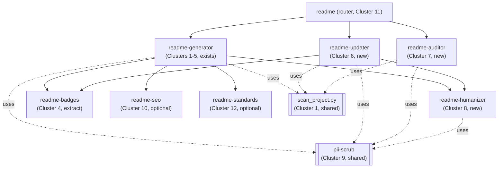

<!--
  First-party planning doc — NOT a vendored skill (unlike references/vendor/**).
  Edit freely. Traceable to CLUSTERED_FEATURES.md (design inventory) and
  TODO.ability.md (code-quality review). Does not change SKILL.md or code.
-->

# README Skill Roadmap

Gap analysis of the current `readme-generator` skill against the 12-cluster
feature inventory in [`CLUSTERED_FEATURES.md`](CLUSTERED_FEATURES.md), plus a
proposed multi-skill (router + subskills) architecture and a relevance-ranked
backlog.

- **Cluster numbers** below refer to `CLUSTERED_FEATURES.md` sections 1–12.
- **Code-quality findings** (`[Sn]` severities) refer to
  [`TODO.ability.md`](TODO.ability.md).
- Vendored design sources are cited as
  `references/vendor/<skill>/file (lines X-Y)` (restore the corpus via
  `references.txt`; it is gitignored).

## 1. Current status matrix

The skill today is a **single, generate-only** skill: `SKILL.md` implements
Steps 1–5, backed by `scripts/scan_project.py` (751 lines), seven type templates
plus companion files in `templates/`, and `references/section-library.md`. Its
own header comment scopes it to generation and notes the "Step 6 updater" is not
implemented (`SKILL.md` lines 18-23).

Legend: **Built** = implemented in the shipped skill · **Partial** = some pieces
present · **Missing** = not implemented.

| #   | Cluster                               | Status      | Evidence / notes                                                                                                                                                                                                                                                                                            |
| --- | ------------------------------------- | ----------- | ----------------------------------------------------------------------------------------------------------------------------------------------------------------------------------------------------------------------------------------------------------------------------------------------------------- |
| 1   | Codebase scanning & metadata          | **Built**   | `scan_project.py` covers manifests, package-manager, monorepo, tree, CI, sibling docs, git (`SKILL.md` Step 1), plus a manifest SPDX license fallback (TODO Interoperability S3, resolved). Gaps: no public-API/signature extraction (pushed to agent judgement, `SKILL.md` 1b), no social-link harvesting. |
| 2   | Project-type awareness & sections     | **Built**   | Seven types, type→section matrix, voice profiles (`SKILL.md` Step 2).                                                                                                                                                                                                                                       |
| 3   | Templates & section libraries         | **Built**   | Depth tiers, 7 skeletons, `references/section-library.md`, companion files, conditional TOC, progressive disclosure (`SKILL.md` Step 3; `templates/`).                                                                                                                                                      |
| 4   | Badges                                | **Built**   | pybadges static-SVG approach (`SKILL.md` Step 4), installed from the maintained fork so it runs on Python 3.9–3.14 (TODO Sustainability S4, resolved); all templates now use relative-path SVGs (TODO Cohesion S4/S2, resolved). See §2.                                                                    |
| 5   | Visuals & diagrams                    | **Built**   | Mermaid + ASCII architecture, file tree, optional star-history (`SKILL.md` Step 5).                                                                                                                                                                                                                         |
| 6   | Updating / syncing an existing README | **Missing** | The entire "updater half." No git-diff/history scan, stale/placeholder detection, minimal-edit strategy, or diff-summary.                                                                                                                                                                                   |
| 7   | Auditing & scoring                    | **Missing** | No audit mode, scored rubric, or eval/self-test harness. The skill currently has no evals at all.                                                                                                                                                                                                           |
| 8   | Writing quality / humanizing          | **Missing** | No humanize/lint pass, slop removal, or readability scoring. `SKILL.md` 2c has a manual "read back and cut hedges" note only.                                                                                                                                                                               |
| 9   | Security / PII / agent-safety         | **Missing** | CLUSTERED_FEATURES recommends "run a secret/PII scrub in every mode"; not implemented on the generate path.                                                                                                                                                                                                 |
| 10  | Discoverability (SEO / AEO)           | **Missing** | No topics/About/social-preview/llms.txt add-on.                                                                                                                                                                                                                                                             |
| 11  | Workflow / modes / router             | **Partial** | Only the generate mode exists. No mode router, optional interview, or parallel sub-agent scanning.                                                                                                                                                                                                          |
| 12  | Standards & spec compliance           | **Missing** | No Standard Readme spec mode, configurable house-style, or RST/PyPI output.                                                                                                                                                                                                                                 |

Summary: **5 built** (1–5), **1 partial** (11), **6 missing**
(6, 7, 8, 9, 10, 12). Clusters 2, 3, 5 are internal to the generator and are not
independently triggerable; clusters 1 and 9 are cross-cutting.

## 2. Live defects (resolved 2026-08-04)

Two issues blocked or undermined the **already-shipping generate path**. Both are
now fixed; kept here as a record of the resolution.

### D1 — pybadges crashes on Python 3.13+ (host runs 3.14.6) — RESOLVED

- **What:** `SKILL.md` Step 4 makes `pybadges` ≥ 3.0.1 a hard dependency, but
  upstream imports the stdlib `imghdr` removed in Python 3.13, so it raised
  `ImportError` on any invocation. The local interpreter is 3.14.6, so the
  default documented environment could not generate badges.
- **Source:** TODO Sustainability S4 (`SKILL.md:333`, `DEPENDENCIES.md:34`).
  Discoverability was improved earlier (TODO Accessibility S2, resolved).
- **Resolution:** Adopted a fourth option beyond the three originally listed —
  a maintained fork, <https://github.com/NicholasSynovic/pybadges>, which
  replaces the `imghdr` import with the `filetype` library and supports Python
  3.9–3.14. `DEPENDENCIES.md` and `SKILL.md` Step 4 now direct operators to
  `pip install git+https://github.com/NicholasSynovic/pybadges`. No
  `standard-imghdr` shim and no downgraded interpreter are needed.
- **Verified:** installed the fork in a clean Python 3.14.6 venv and rendered a
  license badge to SVG (exit 0) — the exact invocation that previously crashed.

### D2 — templates emit shields.io URLs, contradicting Step 4's pybadges-only mandate — RESOLVED

- **What:** Step 4 states badges are "generated as static local SVG files with
  `pybadges` … referenced by relative path — **not** hosted shields.io URLs"
  (`SKILL.md:329`, guardrail `:424`), yet three skeletons hardcoded
  `https://img.shields.io/...` markup: `templates/cli.md`, `templates/library.md`,
  `templates/framework.md`. An agent filling a template verbatim shipped exactly
  the third-party runtime-fetch badges the skill claims to have migrated away
  from.
- **Source:** TODO Cohesion S4.
- **Resolution:** Replaced the shields.io markup in all three skeletons with the
  pybadges relative-path form (`./assets/badges/*.svg`), each preceded by a
  comment pointing at Step 4 and the 4a gate. No `img.shields.io` URL remains in
  any first-party template.
- **Related (also resolved):** TODO Cohesion S2 — the four badge-less skeletons
  (`monorepo`, `application`, `personal`, and the conditional `collection`) now
  carry an explicit comment at the title slot stating the Step 2b badge policy,
  so the omission reads as deliberate.

## 3. Proposed multi-skill architecture (router + subskills)

The 12 clusters map cleanly onto a **thin router + focused subskills** layout,
with the scanner and the security scrub shared across all of them. This matches
cluster boundaries and keeps each subskill independently triggerable and
testable, at the cost of more files to maintain than a single skill.

### Router

- **`readme` (Cluster 11).** A thin decision-tree router: reads whether a README
  exists and what the user asked for, then dispatches to generate / update /
  audit. Draw from
  `references/vendor/github-readme/SKILL.md` (lines 34-43) and
  `references/vendor/repository-readme-writer/SKILL.md` (lines 19-37).
    - **Alternative considered:** keep `readme-generator` itself as the router
      (its header already anticipates a "Step 6 updater"). **Recommended: a
      dedicated thin router** so the generate skill stays single-purpose and the
      router's trigger ("work on my README" without a clear verb) does not
      swallow the more specific generate/update/audit triggers.

### Subskills

| Subskill           | Source cluster(s) | Primary vendored models                                                              | Shared deps                           | Trigger boundary                                                              |
| ------------------ | ----------------- | ------------------------------------------------------------------------------------ | ------------------------------------- | ----------------------------------------------------------------------------- |
| `readme-generator` | 1–5 (exists)      | crafting-readme-files, readme-craft, readme-generator, github-readme, readme-creator | scanner, pii-scrub                    | "write / create / generate / scaffold a README" (no README, or from scratch). |
| `readme-updater`   | 6                 | update-readme, sc-readme, readme-updater                                             | scanner, pii-scrub, badges, humanizer | "update / refresh / sync / fix my README", README already exists.             |
| `readme-auditor`   | 7                 | github-readme (0-100 rubric), readme, readme-creator (hard-fail checklist)           | scanner, pii-scrub                    | "review / score / audit my README" — read-only, no writes.                    |
| `readme-humanizer` | 8                 | humanize-readme, readme-writer (FK + vocab scripts)                                  | pii-scrub                             | "humanize / de-slop / improve the writing" — post-processor on any README.    |
| `readme-badges`    | 4                 | readme-badger (design), pybadges (render)                                            | —                                     | "add / regenerate badges." Callable by generator + updater.                   |
| `readme-seo`       | 10 (optional)     | github-readme (SEO/AEO/llms.txt)                                                     | scanner                               | "improve discoverability / add topics / llms.txt."                            |
| `readme-standards` | 12 (optional)     | standard-readme, crafting-effective-readmes, zr-readme, pypi-readme-creator          | —                                     | "make it Standard-Readme compliant / apply house style / RST for PyPI."       |

Clusters 2, 3, 5 stay **inside** `readme-generator` (not independently
triggerable). Clusters 1 and 9 are **shared code, not subskills** (see below).

### Shared components (not subskills)

- **Scanner (Cluster 1) — `scripts/scan_project.py`.** Already exists; promote
  it to a shared dependency consumed by generator, updater, and auditor. No
  duplication of scanning logic across subskills.
- **PII / secret scrub (Cluster 9).** Recommend a reusable
  `scripts/` module (e.g. `scrub_pii.py`) invoked as a guardrail by every
  subskill that reads code or writes a README, rather than repeating prose rules
  in each `SKILL.md`. Design from
  `references/vendor/github-readme/REFERENCE.md` (lines 463-560) and the
  agent-safe conventions in
  `references/vendor/repository-readme-writer/references/gotchas.md`.

## 4. Relevance-ranked backlog

Ranked by how much each item moves the project from its current state. Scope:
**S** ≈ hours, **M** ≈ a day, **L** ≈ multi-day.

| Rank  | Item                                      | Cluster / defect | Scope | Depends on    | Rationale                                                                                              |
| ----- | ----------------------------------------- | ---------------- | ----- | ------------- | ------------------------------------------------------------------------------------------------------ |
| ~~1~~ | ~~Fix pybadges Python 3.13+ crash~~       | D1 (Cluster 4)   | S     | —             | **Done (2026-08-04)** — switched to the maintained fork; verified rendering on Python 3.14.6.          |
| ~~2~~ | ~~Fix shields.io/template contradiction~~ | D2 (Cluster 4)   | S     | —             | **Done (2026-08-04)** — all templates use relative-path SVGs; badge policy documented per type.        |
| 3     | PII / secret scrub (shared)               | Cluster 9        | S–M   | —             | Small, high-impact; belongs on the existing generate path now to avoid leaking scanned secrets/paths.  |
| 4     | Humanize / lint pass                      | Cluster 8        | M     | 3             | Improves the quality of the thing that already works; self-contained (ships its own FK/vocab scripts). |
| 5     | Audit mode + first eval harness           | Cluster 7        | M     | scanner       | Read-only, reuses the scanner, and gives the skill its first eval/verify harness (currently none).     |
| 6     | Updater subskill                          | Cluster 6        | L     | scanner, 3, 4 | Completes the stated "generator + updater" vision; largest scope.                                      |
| 7     | Mode router                               | Cluster 11       | S–M   | 5, 6          | Only worth building once ≥2 write/read modes exist.                                                    |
| 8     | Standards / spec mode                     | Cluster 12       | M     | 3             | Optional; niche (Standard Readme, house style, RST/PyPI).                                              |
| 9     | Discoverability / SEO / llms.txt          | Cluster 10       | S–M   | scanner       | Optional add-on; lowest urgency.                                                                       |

Items 1–2 are complete, so the live-defect backlog is clear and item 3 is now the
top of the queue. Extraction of `readme-badges` (Cluster 4) into its own callable
subskill is a refactor that naturally follows items 1–2; sequence it whenever the
updater (item 6) needs to call badge regeneration.

## 5. Cross-references

- **Design inventory:** every capability above traces to a numbered cluster in
  [`CLUSTERED_FEATURES.md`](CLUSTERED_FEATURES.md) (sections 1–12) and its
  per-cluster "For the merged skill" note.
- **Code-quality review:** the live defects and several scanner gaps came from
  [`TODO.ability.md`](TODO.ability.md); all are resolved as of 2026-08-04:
    - D1 ↔ Sustainability **S4**, Accessibility **S2** (discoverability).
    - D2 ↔ Cohesion **S4**; related Cohesion **S2** (badge-slot policy).
    - Cluster 1 gaps ↔ Interoperability **S3** (license manifest fallback, added),
      Documentation **S2** / Maintainability **S3** (dead `default_branch` field,
      removed from `detect_git` and the Step 1a field table).
- **Sources:** vendored citations use `references/vendor/<skill>/file (lines X-Y)`;
  installed skills and their repositories are listed in
  [`CITATIONS.md`](CITATIONS.md) and [`references.txt`](references.txt).
